# Password manager

This project is an easy-to-use innovative password manager.
It allows users to get strong and unique passwords using a master password.
That's all. You can try [here](https://passwords.mubelotix.dev)\
Passwords are the result of a cryptographic hash that takes as input the master password and a domain name.




## Building

Building is very easy thanks to [Rust](https://www.rust-lang.org/) and [Trunk](https://github.com/thedodd/trunk).

Install [Rust](https://www.rust-lang.org/):
```console
curl --proto '=https' --tlsv1.2 -sSf https://sh.rustup.rs | sh
```

Install [Trunk](https://github.com/thedodd/trunk):
```console
cargo install trunk
cargo install wasm-bindgen-cli
```

Build this project:
```console
git clone https://github.com/Mubelotix/password-tool
cd password-tool
trunk serve
```

## Roadmap

### Two-factor authentification

All of this is great, but there is still a security threat: keyloggers.\
There is not much we can do against keyloggers.\
OS should detect and kill them, but it seems that they don't feel responsible.\
That's why we need 2FA.\
You type one part of your master password on a device and the other part on another device.\
This way, it is not possible for someone to steal your password without having a keylogger on both devices.\
Sounds great! Let's implement this.

### IPFS-hosted website

[IPFS](https://ipfs.io/) is the perfect place to host this kind of client-side apps.\
Currently, my webserver is located in France, so it may seem slow to you.\
IPFS is a distributed network, so one day, there will be people hosting the files all around the world, and this will be blazing fast.\
In addition to that, IPFS can guarantee that the page is what you expect and not a malicious version since IPFS files are immutable.

### Web extension

What do you think about a web extension auto-completing the passwords fields?\
Users would only have to enter their master passwords when starting a new browser session because we cannot store it securely.
